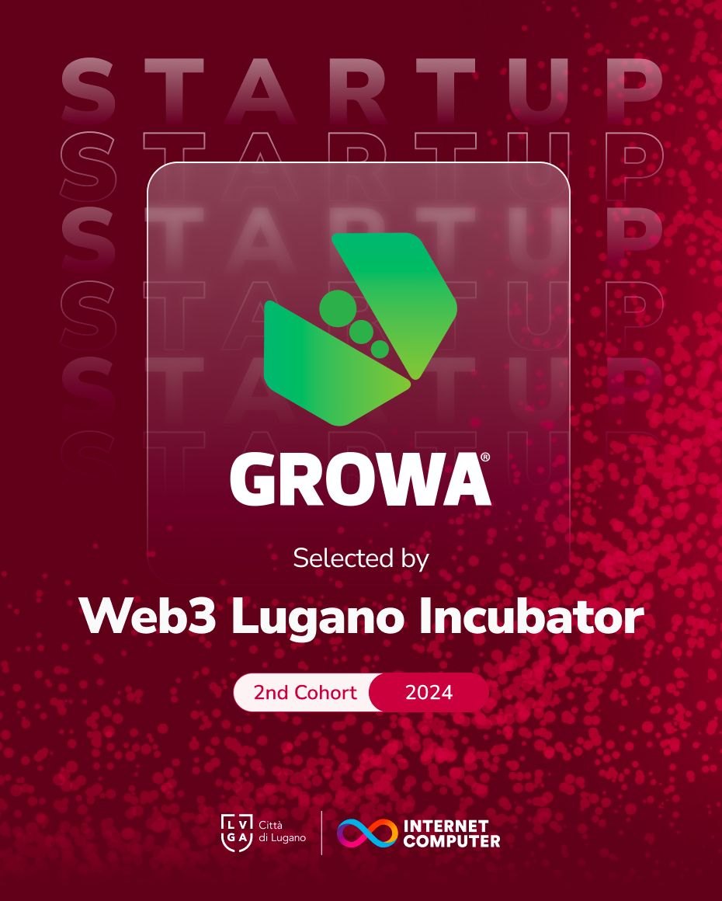
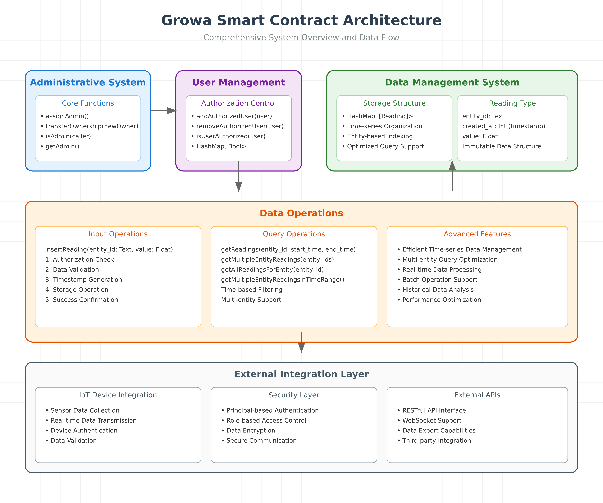

# Growa Smart Contract for Internet Computer Protocol (ICP)



## Overview

The Growa Smart Contract represents a significant advancement in IoT data management on the Internet Computer Protocol (ICP). Our solution has been meticulously designed to address the complex challenges of modern IoT data handling, particularly in industrial and agricultural applications. By leveraging the decentralized nature of ICP, we've created a system that not only ensures data integrity and security but also provides unparalleled scalability for growing IoT networks.

At its core, this smart contract implements a sophisticated authorization system that works in harmony with an efficient time-series data storage mechanism. This combination allows organizations to maintain strict control over their data while ensuring seamless access for authorized users. The system's architecture has been optimized to handle high-frequency sensor readings while maintaining responsive query performance, making it ideal for real-time monitoring and analysis applications.

## Architecture

The architecture of our smart contract has been carefully crafted to provide both flexibility and security. At the foundation of our design lies a robust data model that efficiently organizes sensor readings while maintaining quick access patterns for various query types.



### Data Model

The cornerstone of our architecture is the Reading structure, which has been carefully designed to capture all essential aspects of IoT sensor data:

```motoko
type Reading = {
    entity_id: Text;    // Unique identifier for the data source
    created_at: Int;    // Timestamp in nanoseconds
    value: Float;       // The actual sensor reading
};
```

This structure has been optimized for both storage efficiency and query performance. The entity_id allows for logical grouping of readings, while the created_at timestamp enables precise temporal queries. The value field uses a Float type to accommodate a wide range of sensor measurements with necessary precision.

### State Management

Our contract maintains three critical state components, each serving a specific purpose in the overall system architecture:

The owner management system utilizes an optional Principal type to ensure secure initialization and clear ownership:

```motoko
private stable var owner: ?Principal = null;
```

For user authorization, we implement a highly efficient HashMap structure that provides O(1) lookup times for user verification:

```motoko
private var authorizedUsers = HashMap.HashMap<Principal, Bool>(0, Principal.equal, Principal.hash);
```

The reading storage system employs a sophisticated HashMap structure that organizes data by entity while maintaining chronological order:

```motoko
private var readings = HashMap.HashMap<Text, [Reading]>(0, Text.equal, Text.hash);
```

## Administrative Functions

Our contract implements a comprehensive administrative system that ensures secure and controlled access to critical functions. The admin assignment process has been carefully designed to prevent unauthorized access while maintaining system flexibility.

### Admin Assignment

The admin assignment function serves as the foundation of our security model. It can only be executed once during the contract's lifetime, establishing the initial administrative authority:

```motoko
public shared(msg) func assignAdmin() : async Text {
    switch(owner) {
        case null {
            owner := ?msg.caller;
            return "Admin rights assigned successfully";
        };
        case (?_) {
            throw Error.reject("Admin already assigned");
        };
    };
};
```

This function implements several safety checks to ensure proper initialization of the administrative system. When called for the first time, it establishes the caller as the contract's admin. Any subsequent attempts to assign an admin will be rejected, maintaining the security of the system.

### Ownership Transfer

The ownership transfer mechanism provides flexibility in administrative control while maintaining strict security:

```motoko
public shared(msg) func transferOwnership(newOwner: Principal) : async Text {
    switch(owner) {
        case null {
            throw Error.reject("No admin assigned yet");
        };
        case (?currentOwner) {
            if (Principal.equal(msg.caller, currentOwner)) {
                owner := ?newOwner;
                return "Ownership transferred successfully to new admin";
            } else {
                throw Error.reject("Only current admin can transfer ownership");
            };
        };
    };
};
```

## User Management

The user management system provides granular control over access permissions while maintaining system security. Administrators can easily manage user access through a set of intuitive functions that handle both the addition and removal of authorized users.

When adding a new authorized user, the system performs comprehensive validation before granting access:

```motoko
public shared(msg) func addAuthorizedUser(user: Principal) : async Text {
    if (not isAdmin(msg.caller)) {
        throw Error.reject("Only admin can add authorized users");
    };
    authorizedUsers.put(user, true);
    return "User authorized successfully";
};
```

## Data Operations

Our data management system has been engineered to handle high-frequency sensor readings while maintaining quick access to historical data. The system supports various query patterns to accommodate different analytical needs.

### Reading Insertion

The reading insertion process has been optimized for performance while maintaining data integrity:

```motoko
public shared(msg) func insertReading(entity_id: Text, value: Float) : async Text {
    switch(authorizedUsers.get(msg.caller)) {
        case null {
            throw Error.reject("Unauthorized user");
        };
        case (?authorized) {
            if (not authorized) {
                throw Error.reject("Unauthorized user");
            };
            
            let reading: Reading = {
                entity_id = entity_id;
                created_at = Time.now();
                value = value;
            };
            // Additional insertion logic...
        };
    };
};
```

### Query Capabilities

Our contract provides sophisticated query capabilities that allow users to retrieve data in various ways. The time-range query function exemplifies our approach to efficient data retrieval:

```motoko
public query func getReadings(entity_id: Text, start_time: Int, end_time: Int) : async [Reading] {
    switch(readings.get(entity_id)) {
        case null { return []; };
        case (?entityReadings) {
            return Array.filter(entityReadings, func (reading: Reading) : Bool {
                reading.created_at >= start_time and reading.created_at <= end_time
            });
        };
    };
};
```

## Security Considerations

Security is paramount in our design. The contract implements multiple layers of protection to ensure data integrity and access control. Our authorization system verifies every interaction with the contract, ensuring that only permitted operations are executed by authenticated users.

## Deployment Guide

Deploying the Growa Smart Contract requires careful attention to the initialization process. Before deployment, ensure that you have the ICP SDK installed and configured properly. The deployment process begins with pushing the contract to the Internet Computer network, followed by the crucial step of admin initialization.

## Support and Maintenance

We provide comprehensive support for the Growa Smart Contract through multiple channels. Our technical team is available to assist with deployment, configuration, and ongoing maintenance needs. Regular updates are provided to enhance functionality and address any emerging security considerations.

For technical support and inquiries:
- Email: info@growa.ai
- Website: www.growa.ai

## License

Copyright © 2023 Growa.AI Ltd. - All rights reserved

---

*This documentation is maintained and updated regularly to reflect the latest developments and best practices in IoT data management on the Internet Computer Protocol.*
